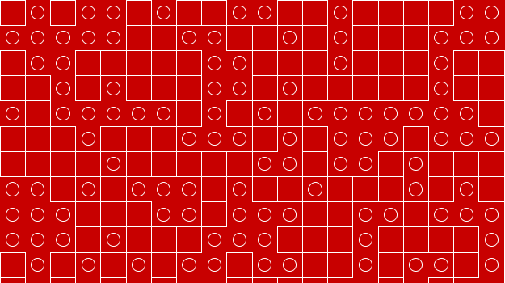

# Week 3 Class Notes

Opening Video: [Miyamoto on SMB 1-1](https://www.youtube.com/watch?t=205&v=zRGRJRUWafY)

Homework Intro


## Loops

Javascript provides a flow control structure called a [for loop](https://developer.mozilla.org/en-US/docs/Web/JavaScript/Reference/Statements/for). With loops, you can ask Javascript to execute a single block of code multiple times. 

The basic syntax of a loop looks like this:

```javascript
for ( initialExpression, condition, incrementExpression ) {
	//code to repeat
}
```

When the `for` control structure is executed, Javascript follows these steps:

1. The `initialExpression` is excuted once.
2. The `condition` is evaluated to `true` or `false`
3. If `true`, continue. If `false`, **exit** the loop.
4. Run the code in the block.
5. Run the `incrementExpression`
6. Repeat from step 2.

The MDN Javascript guide also [describes for statements](https://developer.mozilla.org/en-US/docs/Web/JavaScript/Guide/Loops_and_iteration#for_statement).

### Idiomatic Loops

The code in `initialExpression`, `condition`, and `incrementExpression` could potentially be any legal expression, but it is very common for a for loop to look like this:

```javascript
for (var i = 0; i < 10; i++){
	// repeated code
}
```

This code will execute 10 times, with `i` having a values of 0, 1, 2, 3, 4, 5, 6, 7, 8, and 9. After the last time the repeated code is run, `i` will be incremented to 10. Because 10 is not less than 10, the loop will exit.


### Loops Can Shorten Code

Compare this code that doesn't use a loop....

```javascript
line( random(0, 400), random(0, 400), random(0, 400), random(0, 400));
line( random(0, 400), random(0, 400), random(0, 400), random(0, 400));
line( random(0, 400), random(0, 400), random(0, 400), random(0, 400));
line( random(0, 400), random(0, 400), random(0, 400), random(0, 400));
line( random(0, 400), random(0, 400), random(0, 400), random(0, 400));
line( random(0, 400), random(0, 400), random(0, 400), random(0, 400));
line( random(0, 400), random(0, 400), random(0, 400), random(0, 400));
line( random(0, 400), random(0, 400), random(0, 400), random(0, 400));
line( random(0, 400), random(0, 400), random(0, 400), random(0, 400));
line( random(0, 400), random(0, 400), random(0, 400), random(0, 400));
```

...to this code that does.

```javascript
for (int n = 0; n < 10; n++) {
	line( random(0, 400), random(0, 400), random(0, 400), random(0, 400));
}
```

These code snippets do the same thing: draw ten randomly placed lines. The version with the loop is shorter, clearer, and easier to maintain. With just ten lines, either approach could work. If we wanted to draw hundreds or thousands of lines, using a loop is the only practical choice.

### Loops + Math = Power

When you use the a loop the **same code** is executed multiple times, but that code doesn't have to do the **same thing** every time. By combining loops with variables and expressions, we can create complex effects.

<a href="./loopmath.js" class="p5_example show-lab show-lab-link hidden">loop_math</a>


### Composing Flow Control

You can use `for` and `if` statements inside the blocks of other `for` and `if` statements.

<a href="./compose.js" class="p5_example show-lab show-lab-link hidden">loop_math</a>


### Demo Challenge




## What Interactivity Is

> interactive, adj.
> 
> ...acting upon or influencing each other

— [Oxford English Dictionary](http://www.oed.com/view/Entry/97521?redirectedFrom=interactive#eid)


A core issue in interactive work is how the viewer effects their experience. In non-interactive works, the viewer has no influence on the form of the work; what the viewer sees and hears is decided entirely when the work is created. In interactive works, the viewer makes choices that influence -- or even contribute to -- what they see and experience.

One of the key things to consider when designing or criticizing an interactive project is what options and choices are presented to -- and withheld from -- the user.

If you believe that communication is essential to art/design, then all mediums of art/design are arguably interactive to some extent. We tend to call a work interactive only when the the user's actions and choices are an intentional, substantial consideration of the artist.


## Interactivity in p5

### Senses

To be interactive, your program must be able to react to the user. In order to react to the user, it needs a way to sense what the user is doing. There are many types of sensors that can be used with computers. Computers can hear with microphones, and see with cameras. They can feel temperature, weight, wind-speed, light levels, magnetism, accelerations, gravity, and direction. 

One of the most basic sensors used with computers is a switch. The computer keyboard is a collections of switches. Keyboards and mice, and now touch screens, are the most common ways we interact with PCs. 


### Using p5 `setup` and `draw`

When p5 runs your program, it first runs the commands you put in `setup`. It then runs the commands in `draw`. The `draw` function is run repeatedly. By default run is run 60 times every second. This can be changed with [frameRate()](http://p5js.org/reference/#/p5/frameRate).

By changing what you draw each time draw is called, you can create animation. By changing what you draw in response to user input, you can create interaction.

### Using p5 `mouseX` and `mouseY`

The [p5 library](http://p5js.org/reference/) provides an easy way to work with the position of the computer mouse. The `mouseX` and `mouseY` variables are used to communicate the position of the cursor relative to your project's canvas.

The values of `mouseX` and `mouseY` are updated every frame, before your draw function are called.

<a href="./mouseXY.js" class="p5_example show-lab show-lab-link hidden">loop_math</a>

Lets try someting with `mouseX`, `mouseY`, and a loop.

<a href="./mouseXY2.js" class="p5_example show-lab show-lab-link hidden">loop_math</a>


### Using p5 `mouseIsPressed`

The `mouseIsPressed` variable is `boolean`, its value is either `true` or `false`. Processing updates this variable to let you know if the main mouse button is pressed.

<a href="./mousePressed.js" class="p5_example show-lab show-lab-link hidden">loop_math</a>


## Animation in p5

### State

You can create animation by displaying a series of drawings, each slightly different from the last. 

### 1: Update, 2: Draw
In order to do this, you will often use a variable to keep track of where someting is, change that variable a little each time your draw, and then use that variable while drawing.

<a href="./animation.js" class="p5_example show-lab show-lab-link hidden">loop_math</a>

We now have the tools to create complex animations and interactions. Lets look at how we would draw a bouncing ball.

<a href="./animationBounce.js" class="p5_example show-lab show-lab-link hidden">loop_math</a>


# Homework

This week's homework is to recreate a series of small programs (challenges).

[Read the Assignment Prompt](https://github.com/PUCD2035-E-F15/assignment_3/blob/master/prompt.md)

[View the Challenges](challenges.html)

[View the Assignment Repo](https://github.com/PUCD2035-E-F15/assignment_3)


```


```
