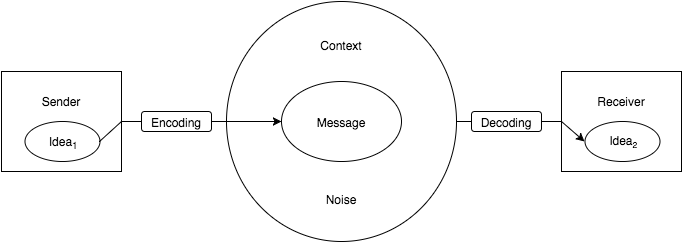

# Week 6 Class Notes

# Section 1 Quiz

[First, The Quiz](#)

4:40
# Interactivity in Design

A core issue in interactive work is how the viewer effects their experience. In non-interactive works, the viewer does not influence form of the work; what the viewer sees and hears is decided entirely when the work is created. In interactive works, the viewer makes choices that influence — or even contribute to — what they see and experience.

One of the key things to consider when designing or criticizing an interactive project is what options and choices are presented to — and withheld from — the user.

If you believe that (1) communication is essential component to art/design, and (2) that communication is inherently interactive, then all mediums of art/design are arguably interactive to some extent. We tend to call a work interactive only when the the user's actions and choices are an intentional, substantial consideration of the artist.

Is a painting interactive? A movie? A video game? A concert?

# Interactivity Spectrum Discussion

5:00
# A Communication Model

There are many [models of communication](https://en.wikipedia.org/wiki/Models_of_communication). Below is a simplfied model for how communication works with traditional (non-interactive) forms like paintings, posters, and public speaking.

  

  

- Ideas themselves cannot be transmitted.
- Ideas must be encoded into form (the message) to be transmitted.
- The receiver must decode the message. Communication does not happen without the receiver participating.
- The message is not decoded alone, it is decoded in with context and noise.
- The idea that the receiver has is not the same idea the sender has: it has been influenced by the encoding skills of the sender, the cultural context, noise, the skill the receiver has in decoding the form, and the receivers existing ideas.

# Text and Context
When communicating, _what you say_ is an important factor in what the audience hears. It is important to recognize, especially for designers, that _how you say it_ is at least as important.

- I didn't say she stole it.

- __I__ didn't say she stole it.
- I __didn't__ say she stole it.
- I didn't __say__ she stole it.
- I didn't say __she__ stole it.
- I didn't say she __stole__ it.
- I didn't say she stole __it.__

  

Take, as an example, a designing a poster:

- What font do you use? [Futura](https://typekit.com/fonts/futura-pt)? [Times](https://www.myfonts.com/fonts/linotype/times/)? [Comic Sans](https://www.google.com/webhp#q=comic+sans)?

- What kind of image do you use? Photo? Illustration? Pure type?
- How big is it? 8"x11"? 11"x17"? 11"x11"? 24"x36"? 96"48"
- What kind of paper do you use? 80 lb card stock? ruled loose-leaf? hot-pink Astrobright? 20 lb copier paper?
- How do you print it? Black and White Laser? Color Laser? Inkjet? Markers? Screen print? 

These decisions each have a major impact on how the audience interprets the meaning of your poster.

# You Can't Not Communicate

You can't opt out of context. 

- If you don't choose a font, there is still a font.

- If you don't include an image, your poster will be purely typographic.
- The poster will be some size, on some kind of paper, and printed in some way. It doesn't matter if you choose these things with purpose or out of convenience, the audience will consider them when they see your poster.

# Interaction Communicates

Interaction a powerful tool expression. 

We present the user with options, they make choices, and our systems react.

Interactive media demands a high level of engagement and participation from a user. It is an active media that recruits the viewer, making them an element in the work. We can build on this aspect of interactive media to create powerful emotional experiences. Consider the difference between seeing and being. [Shovelknight](http://yachtclubgames.com/2015/08/plague-knight-mobility-design/)

Interactive media encourages the user to discover rather than interpret. With interactive media, the viewer can try things and see what happens. This is a powerful process that can be used to inform, educate, and persuade. [SimLife](https://en.wikipedia.org/wiki/SimLife)

One of the most powerful aspects of interactive works is that the audience can shape the work. Highly interactive applications become tools for expression themselves. [Facebook](http://facebook.com), [Photoshop](http://www.photoshop.com/), and [Mario Maker](http://supermariomaker.nintendo.com/)

5:40
# Constructing Meaning with Interaction

Interaction Charades is a design exercise _very loosely_ based on Charades, in that you attempt to convey a specific, secret prompt while limited in how you may communicate.

Constraints:

- You will design and describe an interactive system that conveys the prompt.

- You must describe only what the user does and how the system reacts. Don't describe how the user feels, or why they act. 
- Your system can use only the following elements: The arrow cursor, rectangles, circles, and triangles. Do not combine these elements to create representational figures. You don't need to use all of the elements. You do not need to use the cursor. You can have more than one cursor.
- You can use the following colors for the figures: black, red, and blue. The background is white. Do not use colors for their cultural meanings.
- Assume the user will interact by moving their mouse and pressing the mouse button. The user must be able to interact in some way, and this interaction should be core to the meaning.

Considerations:

- How is interaction used? Interactions are strongest when the user is an active, essential element.
- What is the role of the user? Point of view is very important in interactive media.
- How is shape and color used? Avoid telling your story with shape and color, these should be used mainly to clarify relationships and support the interaction.
- How is movement/animation used? Avoid complex sequences of movement. Movement should be generally be simple and directly related to user interactions.

6:20

# Homework

You will be given 3 prompts. For each prompt, concept and storyboard at least 3 interactive experiences following the constraints of the Interaction Charades exercise.

## Storyboard Format

Print and use the provided storyboard templates. You will also need some fine point Sharpies (black, red, and blue); a pencil, and writing pen. Use the Sharpies to draw the elements in your interaction. Use the pencil to draw arrows and other didactic marks needed to explain motion.

The first frame of each storyboard should show how the scene would look when before the user begins to interact. The second frame should describe an action taken by the user. The third frame should be used to describe the results of the interaction. Consider these as general guidelines: some ideas may require a different structure, or more or less frames. Use one page per concept.

Take time to make your sketches neat and clear. Provide written notes to explain each frame; the visual and written parts should support each other. Your storyboards should communicate your idea on their own, without additional explanation.

You will have 9 (or more) total story boards when you are done. Decide on a title for each interaction design. Make sure each is clearly labeled with your name, the prompt, and the design title. Bring them to class in a folder, also clearly labeled with your name, that you will turn in.
